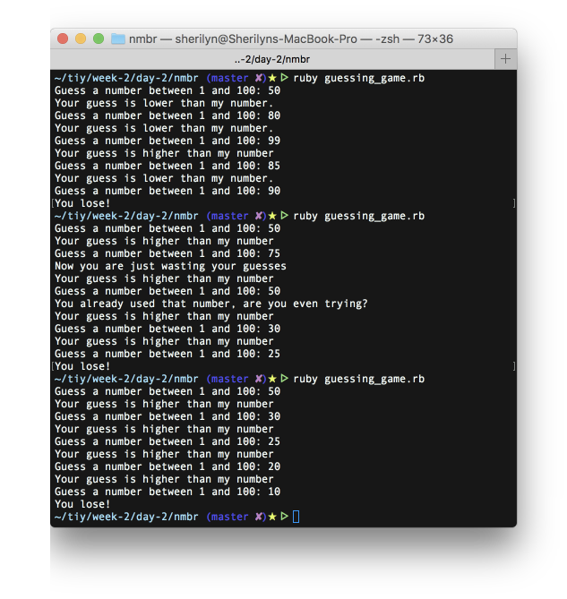

# Number Guessing Game

* This command line program:
  * Picks a random number between 1 and 100
  * Prompts you for a guess
  * If your guess is less than the program's number, it will tell you that you were low and let you guess again.
  * If the guess is greater than the program's number, it will tell you that you were high and let you guess again.
  * If your guess is correct, the program will tell you that you win and then quit.
  * After 5 incorrect guesses, the program will tell you that you lose.

* If you guess the same number twice, the program will ask you if you are even trying (or something similarly sarcastic).

* The random number to be guessed is assigned in the initializer

* The program will also comment on your behavior if you make a guess that doesn't help you.

